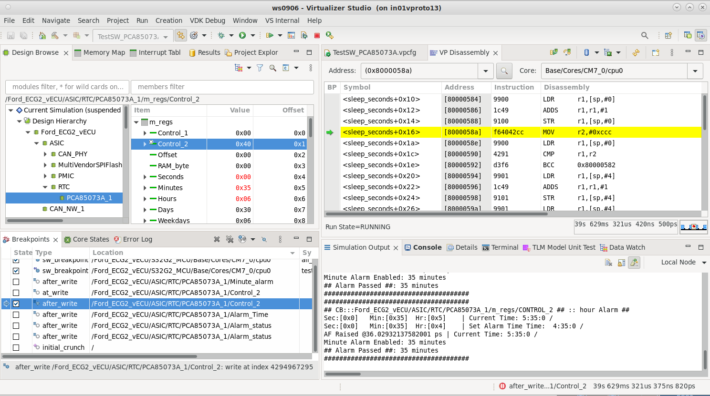
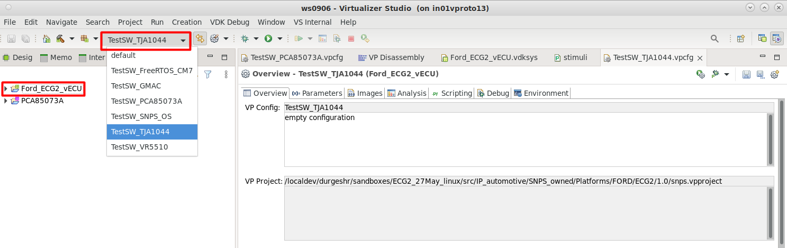
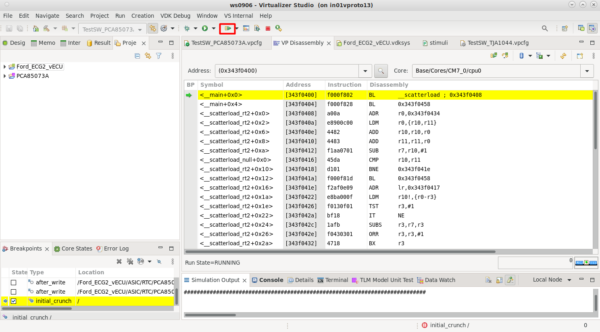
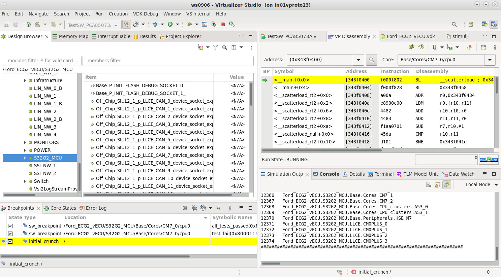
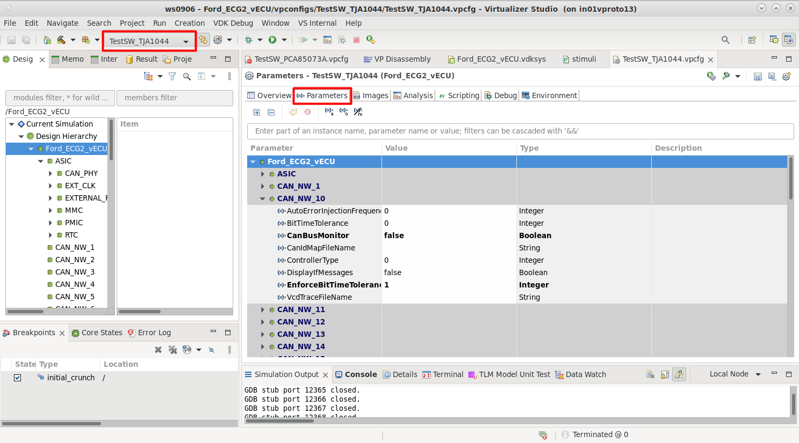
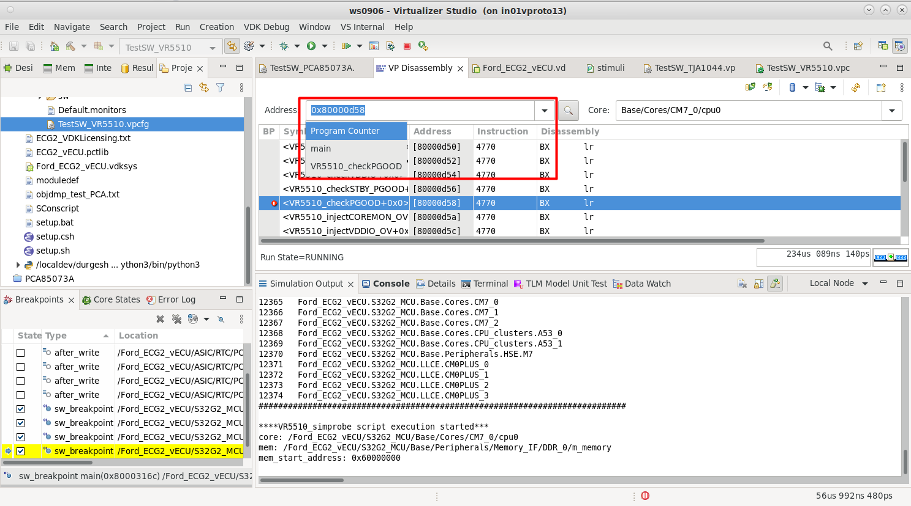
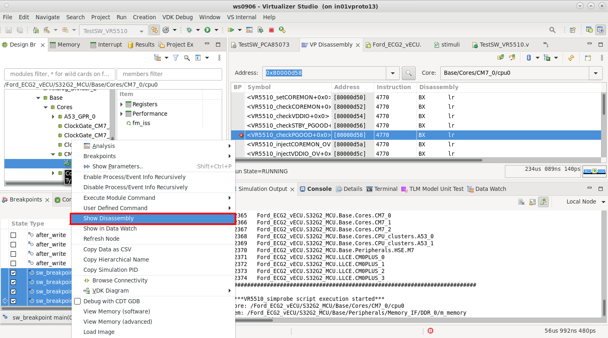

<!-- # FORD ECG2 VDK User Guide -->

<!-- # Introduction
## Overview
The FORD ECG2 VDK User Guide provides detailed instructions and information for users to install, configure, and utilize the ECG2 platform effectively. -->

# FORD ECG2 Installation Guide {#ford-ecg2-installation-guide}
## Prerequisites
- Operating System: Linux or Windows
<!-- TODO: Fill tools -->
- Required tools: GCC, Python 3.x
- Hardware: Compatible MCU platform

## Step-by-Step Instructions
<!-- update linux -->

# Getting Started
This chapter describes how to speed up by running the virtual prototypes included in the FORD ECG2 VP product. This chapter does not provide any detailed  information on the usage of the Virtual Prototypes. Therefore, it is recommended that you go through all the chapters step-by-step and get familiar with the tools by exercising the provided examples.

For more details on how to install these packages, see [FORD ECG2 Installation Guide](#ford-ecg2-installation-guide).

## Virtualizer Studio
Virtualizer Studio is the tool through which you can install a Fixed VDK package, as well as interact with the virtual prototype simulation.

Virtualizer Studio is primarily intended to:

- Run and debug SystemC-based simulations in depth.

- Control simulation execution.

- Trace and analyze simulation output during or after simulation.

The Virtualizer Studio controls the execution of the virtual prototype, for example, suspending the entire virtual prototype. In this case, the entire platform state is frozen, including all timers and clocks. On resuming the execution, the virtual prototype continues from that exact point. As suspending the simulation has no impact on the platform state, it is called non-intrusive.

## VP Configs
To Launch VP Config:

1. Launch Virtualizer Studio

2. Open **Ford_ECG2_vECU** project in the *VDK Creation* perspective.

3. Select the desired VP Config from the top drop-down menu, as shown in the figure below 

4. Click *Run* to launch the VP Config. The perspective will switch to *VDK Debug*.

5. On initial crunch is reached, to start the simulation clock **play button** on the Virtualizer Studio toolbar. When the simulation starts, the output of the simulation can be observed in the Simulation Output tab as shown in

# Introducing Virtual Prototypes
## Virtual Prototype
A virtual prototype is a fast, fully functional software model of a system under development that executes unmodified production code and allows early software development before the real hardware is available. Virtual Prototypes are created using the industry-standard SystemC language and TLM 2.0 inter-operability standard. The extensive system level model, model creation tools and platform assembly tools enable the efficient creation of virtual prototypes; hence ensuring an early virtual prototype availability to enable software development. A virtual prototype can run the same software that the real hardware can run and is therefore binary compatible with it.
At the same time, the virtual prototype should execute the software at a speed that is close to real time; however, the speed is dependent on the software being executed.
Virtual prototypes provide unique debugging and analysis capabilities that result in a more efficient and less expensive software development process. This especially holds true for hardware-dependent software, like boot loaders, operation systems and device drivers, middleware as well as parallel software for multi-core platforms. The software developer can benefit from the observability, non-intrusive debugging and analysis. First of all, thensoftware developer can synchronously halt the whole system, including all processors and peripherals, including timers. Then, the software developer can inspect the state of all the core and peripheral registers, all ports and signals, state of each individual core and the software executing on that core. It is difficult in real hardware to halt the entire system and simultaneously inspect all the hardware and software elements of the system.

Virtual prototypes also allow to hook up certain peripherals to the real world. For example, a UART can be connected to the real UART on the host, or a keyboard and mouse controller can hook up to the host keyboard and mouse device. This way, a device can be operated exactly the same way as the real device would be operated from a user’s point of view. Graphical and physical user interfaces can be optimized and tuned to be intuitive. For automotive application development use case, the virtual prototype can connect to a CAN network through Vector CANoe link, or can connect to tools like Simulink or Saber for analog input values. Using such link, a closed loop simulation of an automotive sub-system can be achieved.

Virtual Prototypes from Synopsys provide additional value for the software developers through an extensive debugging and analysis framework. Virtualizer Studio allows you to control the execution of the platform and is fully scriptable, meaning all user actions can be automated. This enables the creation of complex and fully deterministic test scenarios. Breakpoints and watchpoints can be set on any register or signal. As a result, you can easily identify all software routinesto debug them. For example, writing to a timer configuration register. An OSaware software analysis framework allows to visualize the history of software execution on multiple processors. This enables a very efficient debug process, as well as top-down software performance optimizations. This section provides a high-level overview of the tools available within the virtual prototype package:

- __Virtualizer Studio__

- __Software Analysis__

### Virtualizer Studio
### Software Analysis

## Software Debugger
A software debugger can be attached to each of the individual cores in the platform. Using the debugger, the software developer is able to perform kernel-level debugging. All debuggers and Virtualizer Studio are synchronized. Any debugger that implements the MCD interface is supported by the VDK. For Ford ECG2 VP Lauterbach (TRACE32) debugger is supported.

## Setting parameters using VP Config
With the Virtualizer Studio tool, it is possible to view and change various properties of the simulation. For this, use the Parameters tab of the particular VP Config.

**To edit the parameters:**

1. Switch to Parameters tab in the VP Config window, as shown below.

2. Select the parameter to be changed and enter the new value.

3. Save the VP Config and restart the simulation.

# Using Virtual Prototypes
This chapter gives a basic overview of how to use a virtual prototype and perform some simple debugging steps. A complete manual of the Virtualizer Studio GUI and CLI resides in the Virtualizer toolchain. More advanced debugging and analysis methods are given in subsequent chapters. Launch Virtualizer Studio and select a VP Config. The Virtualizer Studio window appears, as shown below.

## VP Config
VP Config provides all information that is required to launch a Virtual Prototype simulation and runs it in a particular way. It is a collection of simulation executable, its arguments, parameters for the platform/models, software and scripts.
In FORD ECG2 VP, the following VP Configs are present by default:

- `TestSW_GMAC`

- `TestSW_TJA1044`

- `TestSW_VR5510`

- `TestSW_PCA85073A`

## Disassembling Memry Contents
The Disassembly View shows the disassembled object code of the memory that is located at the address to which the core’s program counter is pointing.
For each core, one or multiple Disassembly Views can be opened. Alternatively, the core of a Disassembly View can be changed, as described in the following instructions.

**To select a core:**

The pull-down menu shows a list of all cores within the platform.
When you select a core, the Disassembly View updates and shows the disassembly of this core. If the disassembly is not shown, click Step in the Disassembly window toolbar to turn the core into a debug-able state.

**To inspect an address:**

You can select the address that should be disassembled, as shown below.

It is possible to enter a hexadecimal address, a symbol name, or select Program Counter to follow the program flow.

**To open the Dissassembly View:**

Right-click on the core instance in the hardware hierarchy, and select Show Disassembly. This is illustrated in the following figure.

## Virtual Prototype Control
## Putting BreakPoints
## Connecting to Software Debugger
## Debugging Hardware events using Hardware breakpoints

# Platform Components
This chapter provides information on the Ford ECG2 VP

## Ford ECG2 VECU

The Ford ECG2 VP platform consists of the following components:

- ASICS
    - PMIC (VR5510)
    - CAN Transceiver (TJA1044)
    - RTC (PCA85073A)
    - Flash (MX25UW6345G)
    - MMC (Synopsys Generic SD/MMC)
- MCU
    - NXP S32G2 (For further information see `installDir/Documentation/pdf/S32G2/`)
    \todo{Add correct documenation for S32G2 MCU}
    \todo{Add detailed explanation for the functionality of the PCA85073A RTC model.}

# VP Configs
The VDK provides some default Software skins for references covering Ethernet functionality, TCAN Transceiver working, VR5510 PMIC working, PCA85073A RTC working as follows:

## TestSW_GMAC
The skin tests the functionality of the GMAC , verifying Ethernet Reception/Transmission between GMAC and ETHIo Stub. GMAC device socket is connected with a autogenerated Ethernet IO stub.

## TestSW_VR5510
This skin tests the VR5510 model's registers' access, reset, watchdog functionality, FCCU pins monitoring, COREMON voltage pin monitoring, resetting the MCU by the PMIC pins PGOOD, RSTB and STBY PGOOD, testing the outputs from the PMIC regulators, testing VMONx pins and FOUT clock pin. 

## TestSW_TJA1044
The skin tests the functionality of the TJA1044 transceiver in different modes of operation of the model, verifying CAN Reception/Transmission between BCAN and CANIo Stub. TJA1044 CAN bus socket is connected with MCU(BCAN) and CAN device socket is connected with CANIo Stub. Frame reception and transmission has been checked in two modes  (normal and standby) and mode changes is done using STB pin of TJA1044.There are 10 instances of TJA1044 Transceiver present in vECU.

::: {.todo}
Add detailed explanation for the functionality of the PCA85073A RTC model.
:::

## TestSW_PCA85073A
This skin test the Alarm and Timer functionality for the PCA85073A RTC model.

# Version Information

